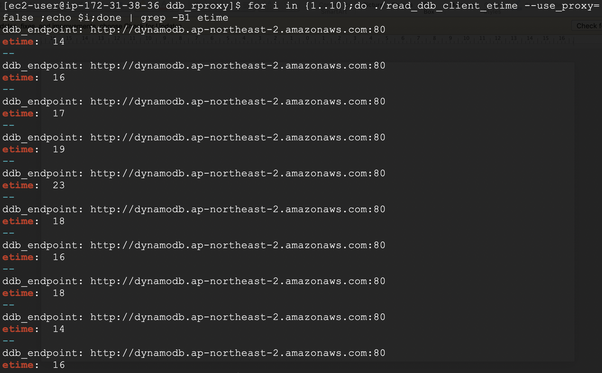

# DDB_Query_Insight
- Date: 2020.09.02
- Yongki Kim(kyongki@)
- ChangeLogs
  - 2020.09.10: adding cdk sources for elasticsearch, firehose
  - 2020.09.03: Adjusted performance result


----


## Objectives
DDB Query Insight is aimed to show Dynamodb user more insight providing with the chart of historical DDB query count, failed query and elapsed time. I developed http reverse proxy to gather http header and body, and push them to kinesis firehose, then firehose sends those data to ElasticSearch to store and visualize the metrics. It will help DDB user understand current and historical DDB query processing status. And It is easy to use, just replacing the DDB Endpoint from default to ddb rproxy is enough to apply it.

### Providing Features
Using the DynamoDB Metric dashboard in AWS console, you can see various metrics, such as read/write requests, throttled read/write events, and GET/PUT/SCAN/Query latency. But sometimes DDB user would like to figure out more specific metrics. Below are the typical metrics which DDB Query Insight can show.
- historical success/failed count
- failed or slow DDB query
- accessed client and table name
- anything which you want to know with http head/body information

## Architecture


## DDB Reverse Proxy(DDB rproxy)
DDB Reverse Proxy(DDB rproxy) gathers http request header and body information, and response header information and it sends them to firehose. Also you can parse the DDB rproxy log data and utilize it by yourself without sending to firehose. I tried to make variables be adjustable as parameters. Therefore, you can input your own variables, not compiling the source code. As well, I created simple script(ddb_rproxy.sh) to start and stop easily.
### How to use DDB rproxy
#### clone the git repository
``` shell
$ git clone https://github.com/hatsari/DDB_Query_Insight_ServerSide.git
```
#### run DDB rproxy

``` shell
$ ddb_rproxy.sh start
$ ps aux | grep ddb_rproxy # check whether ddb_rproxy is listed
$ netstat -tnlp             # check whether ddb_rproxy port is opened
```

If you want to change the parameter, edit *DAEMON_OPTS* variable in the *ddb_rproxy.sh*. Available parameters are show with *help* parameter.

``` shell
$ ./ddb_rproxy.sh help

arguments: --port --debug --region_name --stream_name
--port: indicate listen  port number, default:8000
--debug: show detailed logs, default: false
--region_name: aws region name
--send_to_firehose: sending dynamo metrics to kinesis firehose, default: true
--stream_name: kinesis firehose stream name
...
DAEMON_OPTS example:
1) --port=8000 --debug=true
2) --port=8000 --debug=true --region_name=ap-northeast-2 --stream_name=ddbhose --send_to_firehose=false
```
If you want not to integrate with firehose and ElasticSearch, set *--send_to_firehose=false*

All gathered information are stored log file in *logs* directory, so you can process it on your taste. below is the sample log data.

``` shell
$ cat ddbrproxy.2020-08-31-28.log
2020/08/31 15:27:28 DDB rproxy is listening on  8000
2020/08/31 15:28:59 raw metrics: {map[Accept-Encoding:[identity] Authorization:[AWS4-HMAC-SHA256 Credential=/ap-northeast-2/dynamodb/aws4_request, SignedHeaders=accept-encoding;content-length;content-type;host;x-amz-date;x-amz-security-token;x-amz-target, Signature=xxxxxx] Content-Length:[74] Content-Type:[application/x-amz-json-1.0] User-Agent:[aws-sdk-go/1.34.6 (go1.13.4; linux; amd64)] X-Amz-Date:[20200831T152859Z] X-Amz-Security-Token:[==] X-Amz-Target:[DynamoDB_20120810.GetItem]] map[Key:map[title:map[S:Samsara] year:map[N:2011]] TableName:Movies] {"Key":{"title":{"S":"Samsara"},"year":{"N":"2011"}},"TableName":"Movies"} map[Content-Length:[338] Content-Type:[application/x-amz-json-1.0] Date:[Mon, 31 Aug 2020 15:28:58 GMT] X-Amz-Crc32:[3554984406] X-Amzn-Requestid:[1BP4MHBVO2ALEAIEHURDNQ8C6BVV4KQNSO5AEMVJFAJG]] map[] 200 172.31.38.36:47240}
2020/08/31 15:28:59 Metrics::  {
	"Date": "2020-08-31T15:28:59.143491725Z",
	"Method": "GetItem",
	"TableName": "Movies",
	"Query": "{\"Key\":{\"title\":{\"S\":\"Samsara\"},\"year\":{\"N\":\"2011\"}},\"TableName\":\"Movies\"}",
	"ElapsedTime": 12,
	"Client": "172.31.38.36",
	"ResponseCode": 200
}
```
#### compile ddb_rproxy_[version].go
You can modify the source code of ddb_rproxy_[version].go_ as you wish, when you changed it, compile the code with below command.
``` shell
$ go build -o ddb_rproxy ddb_rproxy_[version].go
```

## Integrating with Kinesis Firehose and ElasticSearch
In order to monitor DDB transaction, analyzing log data is not enough. ElasticSearch and Kinesis firehose is good tool for ingesting and visualizing the data. With those two tools, you can make chars and dashboard easily on your purpose.

### Automating deployment of ElasticSearch & Kinesis Firehose 
I added some cdk sources [here](./cdk/app.py) to make it easy to deploy elasticsearch & firehose. There are 3 stacks which are *ddbqi-es*, *ddbqi-iam*, *ddbqi-firehose*. 

  CDK_PATH: ./cdk

In order to connect to *kibana webconsole* from your laptop, you have to change *ES_CLIENT_IP* variable in *cdk/helper/constants.py*. You can find out your ip address from here(http://www.myipaddress.com/show-my-ip-address/). 

``` shell
$ cd cdk
$ pip install -r requirements.txt
$ sed -i -e 's/127.0.0.1/[your_own_ip]/' helper/constants.py
$ cdk deploy ddbqi-es
$ cdk deploy ddbqi-iam
$ cdk deploy ddbqi-firehose
```
### Creating ElasticSearch
Follow the AWS document: https://docs.aws.amazon.com/elasticsearch-service/latest/developerguide/es-gsg-create-domain.html

1. Go to https://aws.amazon.com, and then choose Sign In to the Console.
2. Under *Analytics*, choose *Elasticsearch Service*.
3. Choose *Create a new domain*.
4. On the *Create Elasticsearch domain* page, choose *Development and testing*.
5. For *Elasticsearch version*, choose the latest version and *Next*.
6. Enter a name for the domain. __DDBES__ for the examples.
7. For *Data nodes*, choose the *c5.large.elasticsearch* instance type. Use the default value of 1 instance.
8. For *Data nodes storage*, use the default values.
9. For now, you can ignore the *Dedicated master nodes, UltraWarm data nodes, Snapshot configuration*, and *Optional Elasticsearch cluster settings* sections.
10. Choose *Next*.
11. For simplicity in this tutorial, we recommend a public access domain. For *Network configuration*, choose *Public access*.
12. For *Fine-grained access control*, choose *Create master user*. Specify a username and password.
13. For now, you can ignore *Amazon Cognito Authentication*.
14. For *Access policy* choose *Allow open access to the domain*. In this tutorial, fine-grained access control handles authentication, not the domain access policy.
15. Leave the encryption settings at their default values, and choose *Next*.
16.  On the *Review* page, double-check your configuration and choose *Confirm*. New domains typically take 15-30 minutes to initialize, but can take longer depending on the configuration. After your domain initializes, make note of its endpoint.

### Creating Firehose
Refer to the AWS Blog: https://aws.amazon.com/blogs/big-data/ingest-streaming-data-into-amazon-elasticsearch-service-within-the-privacy-of-your-vpc-with-amazon-kinesis-data-firehose/#:~:text=Kinesis%20Data%20Firehose%20can%20now,data%20ingestion%20and%20delivery%20infrastructure.
1. On the Kinesis Data Firehose console, under *Data Firehose*, choose *Create Delivery Stream*.
2. Enter a name for your stream;__ddbhose__ ;this name will be used as the value of parameter in ddb_rproxy.sh, .
3.  source, choose *Direct PUT or other sources*.
4. Choose *Next*.
5. For *Data transformation*, don't change default value, keep *Disabled*
6. For *Convert record format*, don't change default value, keep *Disabled*
7. Choose *Next*.
8. Choose *Amazon Elasticsearch* Service as the destination for your delivery stream.
9. For *Domain,*, choose __DDBES__ which you already created.
10. For *Index*, enter __ddbindex__.
11. For *S3 backup*, create new s3 bucket and choose it as *Backup S3 bucket*
12. Choose *Next*, leaving other values unchanged.
13. Don't change anything. Choose *Next*.
14. Finally, *Review* and choose *Create delivery stream*
### Uploading DDB sample data
- for movie table, refer to here:
  - creating table: https://docs.aws.amazon.com/amazondynamodb/latest/developerguide/GettingStarted.Python.01.html
  - loading data: https://docs.aws.amazon.com/amazondynamodb/latest/developerguide/GettingStarted.Python.02.html
- for ProductCatalog, Forum, Thread, Reply tables, refer to here:
  - creating tables: https://docs.aws.amazon.com/amazondynamodb/latest/developerguide/SampleData.CreateTables.html
  - loading data: https://docs.aws.amazon.com/amazondynamodb/latest/developerguide/SampleData.LoadData.html

### Making DDB rproxy connect to firehose
- confirm ElasticSearch is running in AWS console
- check the firehose name in AWS console
- set parameters of *--send_to_firehose=true* and *--stream_name=ddbhose* in ddb_rproxy.sh
``` shell
$ head -n 15 ddb_rproxy.sh | grep DAEMON_OPTS
DAEMON_OPTS="--send_to_firehose=true --stream_name=ddbhose"
```
### Creating client application
It is necessary to replace the DDB endpoint to use ddb_rproxy. Default Dynamo DB endpoint is *dynamodb.ap-northeast-2.amazonaws.com*, and you have to change it to ddb_rproxy's ip:port after starting ddb_rproxy

Here is the code snippet of *read_ddb_client.go*
``` go
// snippet of read client
// const DDB_ENDPOINT = "dynamodb.ap-northeast-2.amazonaws.com"
const DDB_ENDPOINT = "http://127.0.0.1:8000"

func main() {
    // Initialize a session in us-west-2 that the SDK will use to load
    // credentials from the shared credentials file ~/.aws/credentials.
    sess, err := session.NewSession(&aws.Config{
        Region: aws.String("ap-northeast-2")},
    )

    // Create DynamoDB client
    // svc := dynamodb.New(sess)
    svc := dynamodb.New(sess, aws.NewConfig().WithEndpoint(DDB_ENDPOINT))
```

For more reliability, if you are in production environment, you have to put *health_check* function which can change the endpoint to default ddb endpoint if ddb_rproxy couldn't be accessible.

I uploaded some clients program written in golang, but you can use any client program written in your favorate programming language. Those clients are fetched from here(https://github.com/awsdocs/aws-doc-sdk-examples/tree/master/go/example_code/dynamodb)

``` go
$ go build read_ddb_client.go
```

## Test
### Run ddb_rproxy
It would be best practice that running ddb_rproxy on the same server with ddb client because it can reduce the latency between proxy and client. Hence, let's run ddb_rproxy
```shell
$ ddb_rproxy.sh start
```
### Run client
``` shell
$ cd ddb_clients
$ for i in {1..10};do ./read_ddb_client ;echo $i;done
```

### Check the retrieved logs in ElasticSearch
It will take 5 min(in default) that the retrieved logs come to ElasticSearch through firehose. After 5 min, you will see the stored data in kibana. Your kibana page can be seen on ElasticSearch dashboard in AWS console


Next, you have to create index pattern. Index patten can be created in *Management* menu. You have use the index name which you set when you create firehose.


For more information, refer to this page(https://docs.aws.amazon.com/elasticsearch-service/latest/developerguide/es-gsg.html)

### Creating kibana chart
To create the chart is very crucial to visualize your metric, but moreover, it is more important to decide which metric you want to see. In kibana, if you have enough metric, you can create your chart easily. There are many type of chart in kibana, so I will demonstrate one typical chart named *historical success/failure chart*.

1. go to *Visualization* menu, and choose *Create visualizaton*.
2. choose *vertical bar*
3. select your index name in source menu
4. on *Bucket* in right pane, click *Add*, and choose *X-axis*
5. set date histogram like below,
  
5. click *Add*, and choose *Split series*
7. set response code, like below,
  
8. *Update* and *Save*

Here is the result chart.


## Performance Comparison
I performed the performance test to compare the response time between when using ddb rproxy and access DDB Directly via HTTPS(443) and accessing DDB Directly via HTTP(80).

``` shell
# 1st case
DDB_ENDPOINT = "https://dynamodb.ap-northeast-2.amazonaws.com:443"
# 2nd case
DDB_ENDPOINT = "http://dynamodb.ap-northeast-2.amazonaws.com:80"
# 3rd case
DDB_ENDPOINT = "http://127.0.0.1:8000"
```

client program(read_ddb_client_etime) is to get the information of book from *Movies* table. Also it prints *ddb_endpoint* and *elapsed_time* in millisecond unit.


### 1st case: Response time when connecting to ddb_endpoint directly via HTTPS
Executed command is here.
``` shell
DDB_ENDPOINT = "https://dynamodb.ap-northeast-2.amazonaws.com:443"
$ for i in {1..10};do ./read_ddb_client_etime --use_proxy=false | grep -B1 etime;done
```
Result is here.


### 2st case: Response time when connecting to ddb_endpoint directly via HTTP
``` shell
DDB_ENDPOINT = "http://dynamodb.ap-northeast-2.amazonaws.com:80"
$ for i in {1..10};do ./read_ddb_client_etime --use_proxy=false | grep -B1 etime;done
```
Result is here.


### 3rd case: Response time when connecting through ddb rproxy
Executed command is here.
``` shell
DDB_ENDPOINT = "http://127.0.0.1:8000"
$ for i in {1..10};do ./read_ddb_client_etime --use_proxy=true | grep -B1 etime;done
```
Result is here.


### Performance Result
As you see the result of each command, I executed the same command 10 times, and get the average time. Also for more accuracy, I performed 100 times command. Result is here:

- average response time when 10 times execution:
  - without proxy, HTTPS: 49 milliseconds
  - without proxy, HTTP: 17 milliseconds
  - with proxy: 35 milliseconds

- average response time when 100 times execution:
  - without proxy: HTTPS: 46 milliseconds
  - without proxy, HTTP: 13 milliseconds
  - with proxy: 26 milliseconds

Dynamo DB's default connection is HTTPS(TLS Communication), it cost about 20mill sec comparing not to use it. And when using ddb_rproxy, it took more 13 mill comparing to HTTP connection. 10 mill's overhead is not bad, I think.

## Next Step
- CDK script to build components automatically  [done, 2020.09.10]
- Containerization to adapt in container environment

## Summary
My customer asked me how to find out which query failed frequently and how to figure it out, so I developed it, even though I am not a professional programmer and not an ElasticSearch expert. And this program is not evaluated in production environment, so please test it in your test environment before adopting it in production. Any feedback, question, and experience is welcome, I just hope that it is helpful to you.

## References
- golang proxy and metric: https://www.sidneyw.com/go-reverse-proxy/ (authentication failed)
- kinesis firehose go example: https://gist.github.com/coboshm/1c89bcc7bf2c9f9694e4984051474951
- reverse proxy: https://developer20.com/writing-proxy-in-go/?utm_source=reddit&utm_medium=link&utm_campaign=proxy-in-go
- args in golang: https://gobyexample.com/command-line-flags
- make daemon script: https://gist.github.com/alobato/1968852
- api gw in lambda: https://github.com/apex/gateway
- aws dynamodb golang example: https://github.com/awsdocs/aws-doc-sdk-examples/tree/master/go/example_code/dynamodb
- aws golang sdk: https://docs.aws.amazon.com/sdk-for-go/api/service/dynamodb/#DynamoDB
- ecs replacing lambda: https://www.gravitywell.co.uk/insights/using-ecs-tasks-on-aws-fargate-to-replace-lambda-functions/
- envoy for dynamodb filter: https://www.envoyproxy.io/docs/envoy/latest/configuration/http/http_filters/dynamodb_filter#config-http-filters-dynamo
- map string interface: https://bitfieldconsulting.com/golang/map-string-interface
- cdk example for ES: https://github.com/aws-samples/aws-cdk-managed-elkk
- cd examples: https://github.com/aws-samples/aws-cdk-examples
